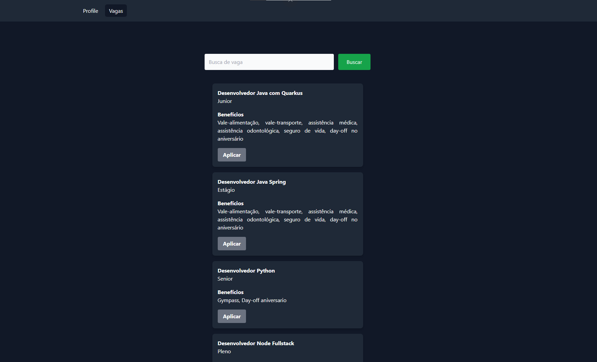

# Front Gestão Vagas


Interface completa do projeto de sistema de controle de empresas, vagas e aplicações. A interface foi construída utilizando Thymeleaf junto com o ecossistema Spring Boot. O sistema permite que o usuário crie seu cadastro para aplicar em vagas e que as empresas cadastrem novas vagas para realizar contratações.


<div>
  <table>
  <tr>
    <td></td>
    <td></td>
  </table>
  </tr>
</div>


## Tabela de Conteúdos

- [Requisitos](#requisitos)
- [Instalação](#instalação)
- [Rotas](#rotas)
- [Tecnologias](#tecnologias)
- [Autor](#conecte-se-comigo)

## Requisitos

- Instale e configure a API [Gestão de Vagas](https://github.com/matheusgmello/gestao-vagas).

## Instalação

**Clone o projeto e acesse a pasta**

```bash
git@github.com:matheusgmello/front-gestao-vagas.git
```

- Instale as dependências com o Maven.
- Suba a aplicação com o Maven via terminal (`mvn spring-boot:run`)
- Acesse (`http://localhost:8082`)

## Rotas

### Candidato
- Área do candidato para realizar o login (`http://localhost:8082/candidate/login`).
- Área para efetuar a criação de conta (`http://localhost:8082/candidate/create`).
- Área do perfil do candidato (`http://localhost:8082/candidate/profile`).
- Área para realizar busca por vagas (`http://localhost:8082/candidate/jobs`).

### Empresa
- Área da empresa para realizar o login (`http://localhost:8082/company/login`).
- Área para efetuar a criação de conta (`http://localhost:8082/company/create`).
- Área para cadastrar uma nova vaga (`http://localhost:8082/company/jobs`).
- Área listando todas vagas publicadas pela empresa (`http://localhost:8082/company/jobs/list`).

## Tecnologias

- [ThymeLeaf](https://www.thymeleaf.org/)
- [Java](https://docs.oracle.com/en/java/javase/17/)
- [Spring](https://spring.io/projects/spring-boot/) 
- [Tailwind](https://tailwindcss.com/)
- [JWT](https://docs.spring.io/spring-security/site/docs/current/api/org/springframework/security/oauth2/jwt/Jwt.html)

## Conecte-se comigo
[](https://linkedin.com/in/matheusgmello)
[](https://www.reddit.com/user/math7zw)
[](https://github.com/matheusgmello/)